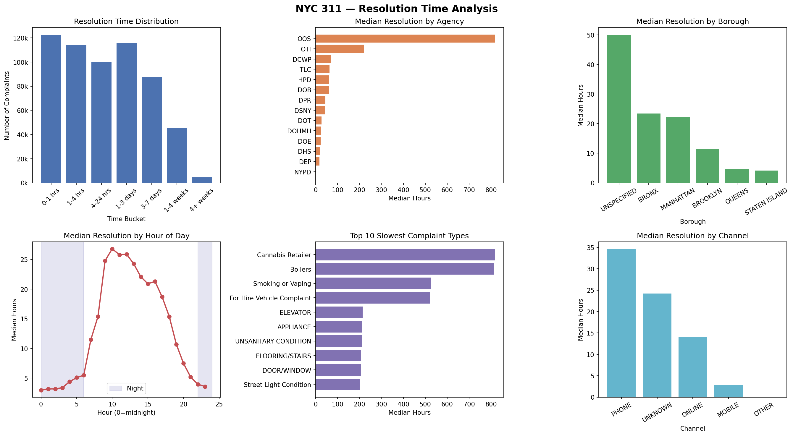
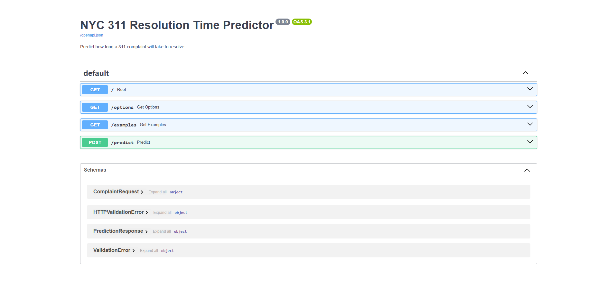

# NYC 311 Response Predictor 🚦

End-to-end NYC 311 pipeline: inspect raw data, load/clean in PostgreSQL, engineer features, train models, generate dashboard, and serve predictions through a FastAPI API.

## What this project does 📌

- Loads NYC 311 data from CSV into PostgreSQL
- Cleans and filters complaints for modeling
- Builds engineered features and trains multiple models
- Saves model artifacts and writes prediction table
- Creates an interactive dashboard (`step7_dashboard.html`)
- Exposes a prediction API (`step8_api.py`)

## Project structure 📁

- `data/Dataset-nyc-311.csv` — source data
- `step1_inspect.py` — initial data inspection
- `step2_load_postgres.py` — load raw data to PostgreSQL
- `step3_clean.py` — clean/filter into modeling tables
- `step4_features.py` — feature engineering
- `step5_eda.py` — SQL EDA + static chart output
- `step6_model.py` — train/evaluate models + save artifacts
- `step7_visualization.py` — build interactive HTML dashboard
- `step8_api.py` — serve model predictions via FastAPI
- `run_step1.ps1` ... `run_step8.ps1` — PowerShell wrappers using local `.venv`
- `best_model.pkl` — saved best model
- `feature_cols.pkl` — training feature schema
- `requirements.txt` — Python dependencies

## Prerequisites ✅

- Windows + PowerShell
- Python 3.12+
- PostgreSQL running locally
- A `.env` file in project root

## Environment setup 🛠️

```powershell
python -m venv .venv
.\.venv\Scripts\Activate.ps1
python -m pip install --upgrade pip
python -m pip install -r requirements.txt
```

## `.env` configuration 🔐

Create `.env` in the project root:

```env
DB_HOST=localhost
DB_PORT=5432
DB_NAME=nyc311
DB_USER=postgres
DB_PASSWORD=your_password_here
```

## Run the full pipeline ▶️

Run in order:

```powershell
.\run_step1.ps1
.\run_step2.ps1
.\run_step3.ps1
.\run_step4.ps1
.\run_step5.ps1
.\run_step6.ps1
.\run_step7.ps1
```

## Run the API (Step 8) 🌐

```powershell
.\run_step8.ps1
```

Then open:

- `http://127.0.0.1:8000/docs` (Swagger UI)
- `http://127.0.0.1:8000` (root endpoint)

Direct docs link (copy/paste):

`http://127.0.0.1:8000/docs`

## Expected outputs 📊

- `step5_eda_charts.png`
- `best_model.pkl`
- `feature_cols.pkl`
- `step7_dashboard.html`
- PostgreSQL tables such as:
	- `nyc311_raw`
	- `nyc311_clean`
	- `nyc311_open`
	- `nyc311_features`
	- `nyc311_predictions`

## Visual preview 🖼️

### EDA charts



### Dashboard

- Interactive dashboard file: `step7_dashboard.html`
- FastAPI docs page: `http://127.0.0.1:8000/docs`



## Quick troubleshooting 🧯

- **`python` command not found / wrong packages**
	- Use the project interpreter explicitly: `.\.venv\Scripts\python.exe ...`

- **Import errors in VS Code**
	- Select interpreter: `Ctrl+Shift+P` → `Python: Select Interpreter` → `.venv\Scripts\python.exe`

- **API not reachable**
	- Ensure Step 8 process is running and use `http://` (not `https://`)

- **Accidentally in Python REPL (`>>>`)**
	- Run `exit()` and execute commands in PowerShell terminal

Prepared by Gireeshee Pendela.
